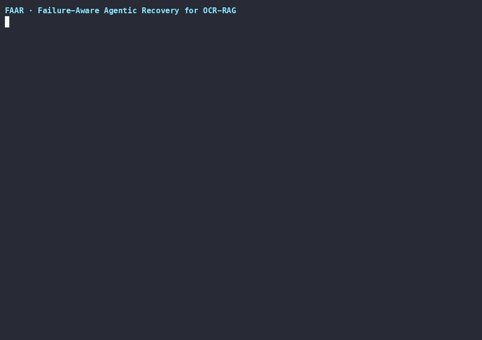

# FailSafeRAG (faar)

> An OCR-RAG pipeline that detects its own retrieval failures and recovers — re-reading pages or answering with measured confidence.

<p align="center"></p>
<details><summary><b>▶ Watch the full demo (~30s)</b></summary>
<video src="assets/demo/demo.mp4" controls width="720"></video></details>

## Why this exists

OCR output is noisy, and noisy OCR breaks retrieval quietly: the pipeline still finds *a* chunk and still produces *an* answer — often a confident, wrong one. The failure is invisible to a naive RAG system because nothing in the text path ever admits the evidence is unreliable. This project asks a research question: can an OCR-RAG pipeline detect **its own** retrieval failures and recover from them, instead of silently answering from degraded evidence?

## What it does

- **Text-first hybrid retrieval** — chunks OCR text and ranks by BM25 + dense embeddings fused with reciprocal-rank fusion; images are never touched on the default path.
- **Quality gate** — scores the top evidence for OCR word noise, layout damage, weak lexical evidence, and weak dense evidence, then passes or fails the example before any answer is trusted.
- **Failure diagnosis + typed recovery routing** — a failed gate is diagnosed (`word_level` / `structural` / `semantic`) and routed to a specific recovery action: OCR-text correction, selective visual fallback, or retrieval retry.
- **Mock-vision fallback** — a swappable VLM backend (`mock` / `openai`) so the visual path is testable offline at zero cost; only routed structural failures ever spend multimodal tokens.
- **Measured answers** — every answer carries an `answer_meta` block (`answer_mode`, `support_score`, source chunk) and the run log records gate scores, diagnosis, and the recovery action taken.
- **Experiment runner + metrics** — `run_profile` runs profiles per example in isolation and logs `ndcg@5`, `recall@5`, `EM`, `F1`, plus a recovered-vs-direct-answer counterfactual per example.

## Architecture

```
  question + example_id
            │
            ▼
  load OCR example ──► chunk & metadata ──► hybrid retrieve (BM25 + dense)
                                            │
                                            ▼
                                       quality gate
                          ┌────────────────┴────────────────┐
                        pass                              fail
                          ▼                                 ▼
                   answer direct                    failure diagnosis
                          │                     ┌───────────┼───────────┐
                          │                     ▼           ▼           ▼
                          │              semantic     word-level   structural
                          │              retry        OCR correct  VLM fallback
                          │                │              │           │
                          └────────────────┴──────┬───────┴───────────┘
                                                  ▼
                                       answer + measured confidence
                                                  │
                                                  ▼
                        per-example metrics log (experiment runner)
```

Pipeline: OCR text (possibly corrupted) → chunk → retrieve → quality gate → diagnose → recover → answer. The controller is a compiled LangGraph state machine (`src/faar/graph.py`) whose nodes map one-to-one onto this diagram.

Module map (`src/faar/`): `data.py` (phase-0 corpus loading) · `chunking.py` · `retrieval.py` (hybrid + RRF fusion) · `quality.py` (gate + diagnosis) · `recovery.py` (semantic backtrack, ByT5 correction, VLM fallback) · `answering.py` (typed span extraction + support score) · `graph.py` (controller) · `experiment_runner.py`, `metrics.py`, `results_aggregator.py`, `phase4_analysis.py` (experiments and reports). See [ARCHITECTURE.md](ARCHITECTURE.md) for the component-level writeup.

## Quick start

```bash
git clone https://github.com/haseebraza715/FailSafeRAG.git
cd FailSafeRAG
python3 -m venv .venv && source .venv/bin/activate
pip install -e .
python scripts/demo/demo_run.py
```

Runs the full pipeline over the committed synthetic corpus in `examples/demo_corpus/` — three tiny pages, one OCR-corrupted. Fully offline and deterministic: local-hash embeddings, mock VLM, seed 42, no API keys, ByT5 disabled by profile.

## Demo

```bash
python scripts/demo/demo_run.py                 # milestone trace (3 examples, ~10s)
faar-demo run-example --project-root examples/demo_corpus \
    --example-id noisy_threshold --vlm-backend mock --seed 42    # full JSON run log
```

`run-example` enables word-level ByT5 correction by default; on macOS builds where faiss and torch OpenMP runtimes conflict, that path can crash — use `scripts/demo/demo_run.py` (ByT5 disabled by profile) or `faar-demo run-benchmark --no-enable-byt5` instead.

**What you'll see:** the corrupted page (`Z3phyr c0mpliance requires a thr3shold…`) retrieves its chunk but fails the quality gate on `word_noise_alert` (corruption 0.474 vs 0.053 clean); the failure is diagnosed as `word_level` and routed to OCR-text correction; the final answer `"42%"` is delivered with `support_score 9` — measurably lower than the clean page's 10. The clean example passes the gate and answers directly with no recovery, and no example invokes the visual model: multimodal spend is zero. The CLI form prints the complete run log, including the gate verdict, routing decision, action outcome, and top hits.

Regenerate the recorded assets with:

```bash
bash scripts/demo/record.sh                     # re-record assets/demo/demo.cast (needs asciinema)
IDLE_LIMIT=3.0 bash scripts/demo/render.sh assets/demo/demo.cast assets/demo   # re-render gif + mp4
```

## Technical decisions

- **Deterministic local-hash embedding backend.** The default `local-hash-v1` backend (blake2b feature hashing over tokens, 256 dims) needs no model download, no GPU, and no network — so every demo and test run is reproducible anywhere. Real sentence-transformers embeddings are available behind the `[ml]` extra and the exact same code path.
- **Quality-gate → diagnosis → recovery routing.** Instead of an LLM agent loop, recovery is a small typed policy: the gate emits concrete signals, `diagnose_failure` maps them to one of three failure types, and the graph routes to the matching action. Failures are first-class, countable objects, which is what makes the cost story measurable.
- **Tie-stable ranking.** Fusion combines normalized BM25 and dense scores with a rank-derived RRF component, and `np.argsort(…, kind="stable")` breaks fused-score ties deterministically — identical inputs always produce identical hit orderings, which keeps the experiment evidence reproducible run to run.
- **Per-example failure isolation.** The experiment runner wraps each example in its own try/except and writes one JSON row per example; a failing example becomes an explicit `error` row instead of aborting the run, and every row records a direct-answer counterfactual so the recovery effect is measurable per example.

## Validation

155 tests pass (`pytest`), including an end-to-end demo over a synthetic OCR-corruption corpus, robustness tests for the retrieval/gate/recovery/answering code paths, and an evidence tripwire that re-runs the committed benchmark aggregation offline and fails if the committed summaries drift. The committed 40-example offline slice shows typed-recovery profiles at parity with the naive baseline (recovery changed 0 of 15 routed cases; EM/F1 effect `equal` in all 15) — claims are limited to routing and cost control, not answer-quality improvement. Run logs, summaries, and the preserved-evidence inventory live in `logs/phase3/`, `artifacts/phase3/`, and [evidence-manifest.tsv](evidence-manifest.tsv).

[](https://github.com/haseebraza715/FailSafeRAG/actions/workflows/tests.yml)

## Limitations

- Phase-1 research prototype: the quality gate and recovery routing are rule-based and tuned on a small slice, not a shipped product.
- Answer extraction is regex/span-based (numeric, date, range, yes/no, extractive overlap) — no free-form reasoning.
- The committed evidence uses a mock VLM; real-VLM answer quality is untested, and word-level ByT5 correction is disabled in the offline profile (it degrades to a guarded skip).
- Benchmark scope is a 40-example committed slice of OHR-Bench; the full benchmark lives in `data/`/`OHR-Bench` and is not tracked.
- On macOS builds where faiss and torch OpenMP runtimes conflict, running the CLI with ByT5 enabled can crash; the demo profile disables it.
