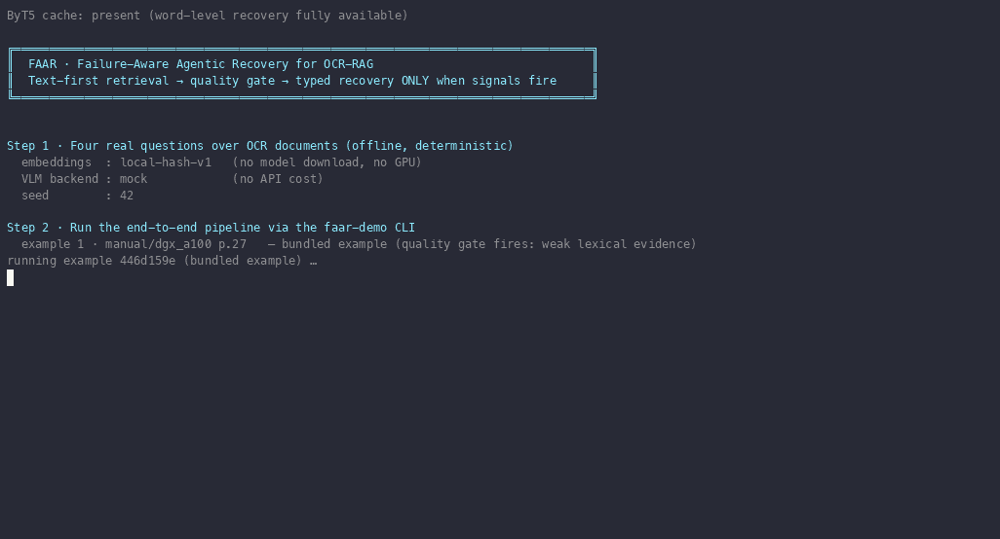

# FailSafeRAG

Failure-Aware Agentic Recovery (FAAR) for OCR-RAG document question answering.

[](https://github.com/haseebraza715/FailSafeRAG)
[](https://www.python.org/downloads/)

**RAG that knows when it's failing and recovers — semantic retry, OCR repair, visual fallback, only when needed.**



## Try it in 60 seconds

```bash
git clone https://github.com/haseebraza715/FailSafeRAG.git
cd FailSafeRAG
python3 -m venv .venv && source .venv/bin/activate
pip install -e .
./scripts/demo.sh
```

Fully offline and deterministic: local-hash embeddings (no model download), a mock
VLM (no API cost), and ByT5 word-level correction served from the local Hugging
Face cache. Four real questions run end-to-end through the `faar-demo` CLI, then a
walkthrough narrates every quality signal and routing decision.

**What you'll see:**

- The quality gate fires on **low lexical evidence** → semantic recovery re-queries
  → the correct answer, at **0 multimodal tokens**.
- A **clean example passes the gate** and answers directly — no recovery, no
  multimodal spend.
- A **routing table** shows the word-level and structural routes; the structural
  case is the only one that would invoke a VLM (mock here — zero spend).

## What it does

- **Text-first retrieval** — hybrid BM25 + dense retrieval over OCR text; images
  are never touched on the default path.
- **Quality gate** — inspects retrieved evidence for OCR word noise, layout/table
  damage, and weak lexical evidence before trusting an answer.
- **Semantic recovery** — re-queries with context-anchored evidence when retrieval
  comes up empty or mismatched.
- **Word-level recovery** — corrects OCR noise (ByT5) before answer generation;
  degrades to a guarded skip when the model is unavailable offline.
- **Structural recovery** — a *selective* visual fallback for layout-heavy
  failures, routed to a VLM only when the gate says text cannot answer.
- **Cost control** — multimodal tokens are spent only on gated failures; clean
  questions cost nothing.
- **Reproducible research** — mock VLM backend and deterministic embeddings for
  fully offline runs; an OHR-Bench benchmark subproject for evaluation.

## How it works

Text-first retrieval → the quality gate scores the evidence (lexical, OCR
corruption, layout signals) → a typed recovery is routed and applied, or the
answer is produced directly → every signal, threshold, and decision is recorded
per run. Recovery is *failure-aware*: it spends compute only when a signal says
the evidence cannot be trusted.

| Fact | Detail |
| --- | --- |
| Language | Python 3.12+ |
| Dependencies | faiss-cpu, langgraph, pydantic, rank-bm25, typer (base); `[ml]` extra adds sentence-transformers, transformers |
| Offline? | Yes — the demo runs with `HF_HUB_OFFLINE=1`, mock VLM, no API keys |
| Status | Research, phased (see [docs/phases](docs/phases/index.md)) |
| License | None specified |

## Setup

Prerequisites: Python 3.12+, phase assets under `data/phase0/` and `artifacts/phase0/`.

The base install covers the deterministic offline path (local-hash embeddings,
mock VLM). Neural components — sentence-transformers embeddings and ByT5 word-level
correction — live in the `ml` extra:

```bash
pip install -e ".[ml]"
```

Verify:

```bash
python -m pytest
```

## Usage

Run one end-to-end example:

```bash
faar-demo run-example --example-id 446d159e-b5c2-45dc-91cc-faaa931f3649 --project-root . --vlm-backend mock --seed 42 --output logs/phase1/phase1_e2e_latest.json
```

Notes:
- `vlm-backend=mock` is the default for offline reproducibility.
- Retrieval defaults to the deterministic `local-hash-v1` embedder; set
  `retrieval.embedding_backend="sentence-transformers"` for research runs that
  intentionally use the pinned external model revision.
- Outputs are written to `logs/` and phase artifacts under `artifacts/`.

## Repository

- `src/faar/` — controller, quality, retrieval, recovery, answering, CLI
- `scripts/` — `demo.sh` one-command demo, `demo_render.py` walkthrough renderer
- `tests/` — unit and integration coverage
- `data/phase0/`, `artifacts/` — benchmark metadata, labels, phase artifacts
- `OHR-Bench/` — benchmark/evaluation subproject
- `docs/` — modular phase and repository documentation

## Honest research stance

This repository is an in-progress research prototype. The checked-in tables
describe an offline 40-example fixture run and are **not** evidence of live
multimodal model quality. Every committed log or artifact is classified in
[`evidence-manifest.tsv`](evidence-manifest.tsv), model identity and asset
provenance are recorded in [`docs/reproducibility.md`](docs/reproducibility.md),
and architecture details live in [`ARCHITECTURE.md`](ARCHITECTURE.md).

## Documentation

- Docs home: [docs/index.md](docs/index.md)
- Phase docs: [docs/phases/index.md](docs/phases/index.md)
- Repo handbook: [docs/repo_handbook/index.md](docs/repo_handbook/index.md)
- Reports: [docs/reports/index.md](docs/reports/index.md)
