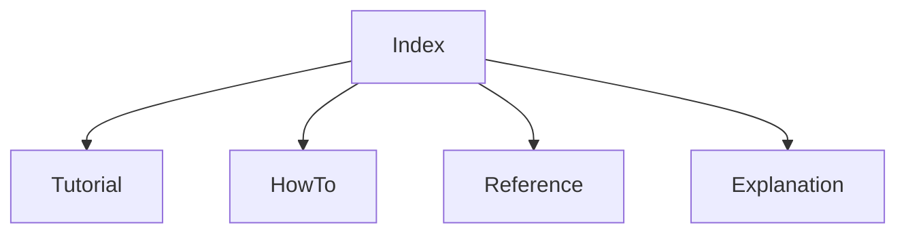

# Repository Architecture Docs (Legacy)

This folder documents the FAAR repository using a Diataxis-oriented layout:

- Tutorial: learn by doing
- How-to: complete specific tasks
- Reference: exact components and interfaces
- Explanation: design rationale and architecture

## Navigation

Canonical modular docs entrypoint:

- [Docs Home](https://github.com/haseebraza715/FailSafeRAG/blob/main/docs/index.md)

- [Repository Handbook Index](https://github.com/haseebraza715/FailSafeRAG/blob/main/docs/repo_handbook/index.md)
- [Architecture Overview](https://github.com/haseebraza715/FailSafeRAG/blob/main/docs/repo_handbook/architecture_overview.md)
- [Runtime Components](https://github.com/haseebraza715/FailSafeRAG/blob/main/docs/repo_handbook/runtime_components.md)
- [Phase 2 Methodology Formalization](https://github.com/haseebraza715/FailSafeRAG/blob/main/docs/phases/phase2/methodology_formalization.md)
- [Phase 2 Code-to-Math Mapping](https://github.com/haseebraza715/FailSafeRAG/blob/main/docs/phases/phase2/code_math_mapping.md)
- [Phase 2 Acceptance Checklist](https://github.com/haseebraza715/FailSafeRAG/blob/main/docs/phases/phase2/acceptance_checklist.md)
- [Documentation Style Standard](https://github.com/haseebraza715/FailSafeRAG/blob/main/docs/repo_handbook/documentation_style_standard.md)

## Documentation Map

